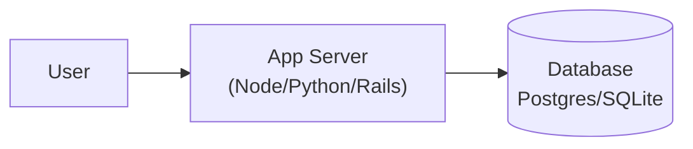
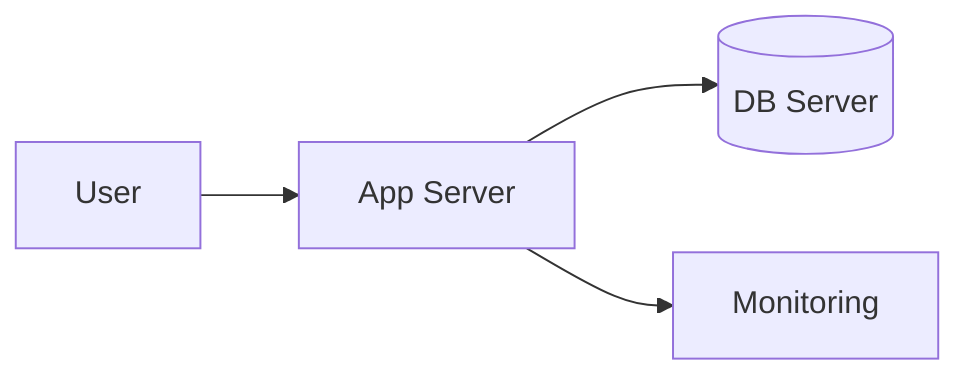
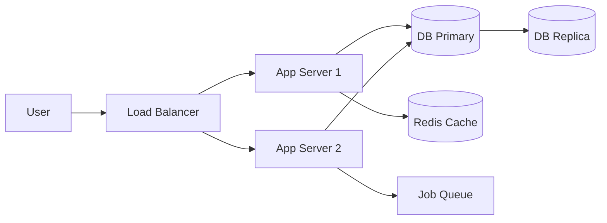

# Architecture Design & Communication

## Overview

Architecture decisions made during sprints must leave durable, shareable artifacts. Two artifacts serve this:

- **`ARCHITECTURE.md`** — Project-level living document: current topology, components, data flow. Updated each sprint when the architecture changes.
- **`.decisions/ADR-NNN.md`** — Architecture Decision Records: one file per significant decision. Never deleted; superseded decisions are marked as such.

## When to Create or Update ARCHITECTURE.md

Create on first sprint that touches architecture (step [3b]). Update when:
- A new component, service, or integration is added
- The deployment topology changes
- A data model change affects system boundaries
- A significant technology choice is made

Do NOT update for minor bug fixes or purely UI changes.

## When to Create an ADR

Create an ADR when any of these are true:
- Two or more valid approaches were considered and one was chosen
- A significant technology, library, or pattern was adopted
- A previous decision is being reversed or superseded
- The rationale would be non-obvious to a new team member in 6 months

One decision = one ADR. Keep them atomic.

## ADR Format

Use `templates/adr.md`. Fields:

| Field | Content |
|-------|---------|
| **Status** | `Proposed` / `Accepted` / `Superseded by ADR-NNN` |
| **Context** | Why this decision was needed — the problem, constraint, or trigger |
| **Decision** | The choice made, stated plainly |
| **Alternatives** | Other options considered and why they were rejected |
| **Consequences** | What becomes easier, harder, or constrained by this choice |

ADR numbering: `ADR-001`, `ADR-002`, ... Zero-padded to three digits. Never reuse numbers.

## ARCHITECTURE.md Structure

Use `templates/architecture.md`. Sections:

1. **Overview** — One paragraph: what the system does, who uses it, at what scale
2. **Topology** — Mermaid diagram of runtime components and their connections
3. **Components** — Table: component name, responsibility, technology
4. **Data Flow** — Key user-facing flows as numbered steps (not diagrams — prose is faster to write and maintain)
5. **Architecture Tier** — Reference to tiers 1/2/3 from `architecture-tiers.md`; current tier + upgrade triggers
6. **Decision Index** — Table linking to all ADRs in `.decisions/`
7. **Open Questions** — Decisions still pending; remove when resolved

## Mermaid Diagram Conventions

Match the diagram to the architecture tier:

**Tier 1 — Single node:**

**Tier 2 — App + DB separated:**

**Tier 3 — Distributed:**

Use `graph LR` (left-to-right) for topology. Use descriptive node labels. Keep diagrams under 15 nodes — if larger, split by domain.

## File Locations

| Artifact | Path |
|----------|------|
| Project architecture doc | `ARCHITECTURE.md` (project root) |
| ADR files | `.decisions/ADR-NNN.md` |
| Architecture skill templates | `skills/architecture/templates/` |
| Distributed pattern catalog | `skills/architecture/references/distributed-patterns.md` |

## Pattern Detection

When writing an ADR triggered by a distributed pattern signal, read
`references/distributed-patterns.md` first. The catalog provides WHEN/WHEN-NOT
guidance and ADR template hints for all 12 patterns. The trigger rule is at
`.claude/rules/arch-patterns.md`.

## Common Rationalizations

| Rationalization | Reality |
|---|---|
| "The architecture is obvious from the code" | Obvious to you today, opaque to a new contributor next quarter. Write it down. |
| "The TDD captures the decision" | TDDs expire with phases. ADRs persist. The decision record survives the sprint. |
| "We'll document when we're done" | Done never comes. Write ARCHITECTURE.md during sprint [3b] when context is fresh. |
| "The diagram will be outdated immediately" | Update the diagram when the topology changes. Stale diagrams are still better than no diagrams. |
| "ADRs are overkill for a small project" | Small projects become large projects. One ADR per sprint is negligible overhead. |

## Verification

- [ ] `ARCHITECTURE.md` exists at project root with all 7 sections populated
- [ ] Mermaid diagram is valid and matches current tier
- [ ] Every significant decision in sprint has a corresponding `.decisions/ADR-NNN.md`
- [ ] Decision Index in `ARCHITECTURE.md` links to all ADRs
- [ ] Superseded ADRs reference their replacement
