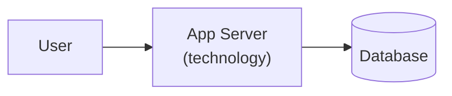

# Architecture — [Project Name]

> Living document. Updated each sprint when the architecture changes. Last updated: [date]

## Overview

[One paragraph: what the system does, who uses it, and at what scale. Example: "ServiConnect is a B2B SaaS platform connecting service providers with SME clients. It handles ~500 monthly active users, processes bookings, and sends automated notifications via Telnyx."]

## Topology

_Replace with tier-appropriate diagram. See `skills/architecture/SKILL.md` for Mermaid conventions._

## Components

| Component | Responsibility | Technology |
|-----------|---------------|------------|
| App Server | Serves API and web UI | [e.g. Next.js / Rails / FastAPI] |
| Database | Primary data store | [e.g. Postgres via Supabase] |
| [Add rows as components are added] | | |

## Data Flow

Key user-facing flows (add as they are built):

**[Flow name, e.g. User books a service]:**
1. User submits booking form → App validates input
2. App writes booking record to DB
3. App triggers notification via [service]
4. Confirmation returned to user

## Architecture Tier

**Current tier:** Tier [1/2/3] — [rationale, e.g. "single VM, co-located app + DB, appropriate for Prototype stage"]

Upgrade trigger: [e.g. "$500+ MRR or DB becoming the bottleneck"]

Reference: `skills/prd/references/architecture-tiers.md`

## Decision Index

| ADR | Title | Status | Sprint |
|-----|-------|--------|--------|
| [ADR-001](.decisions/ADR-001.md) | [Decision title] | Accepted | Phase 01 |

_Add a row for each `.decisions/ADR-NNN.md` file._

## Open Questions

- [ ] [Decision still pending — remove when resolved]
