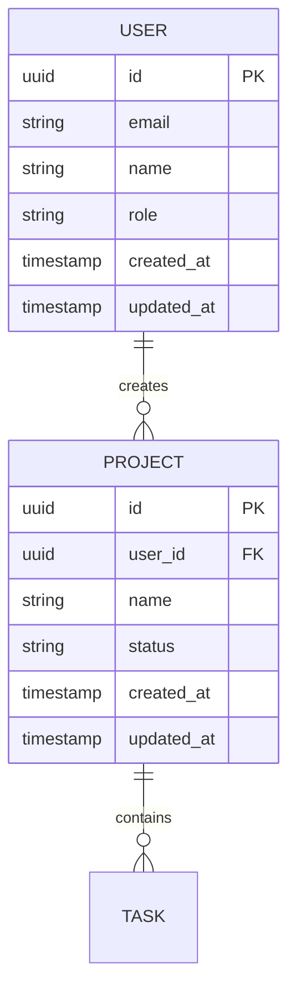

# Workflow: Design (Phase 4)

## Overview
Generates the core design artifacts from accumulated context: PRD, ERD (Mermaid),
and architecture decisions document. Consumes intake context and optionally research
and monetization data.

## Prerequisites
- `.kickstart/context.md` must exist
- `.kickstart/research.md` is optional but consumed if present
- `.monetize/` artifacts are optional but consumed if present

## Steps

### Step 1: Load All Available Context

Read these files and merge into a unified understanding:

| File | Status | What to Extract |
|------|--------|----------------|
| `.kickstart/context.md` | **Required** | Domain model, user journey, auth, integrations, constraints |
| `.kickstart/research.md` | Optional | Stack recommendation, competitor gaps, market validation |
| `.monetize/context.md` | Optional | Business model signals |
| `.monetize/evaluation.md` | Optional | Recommended monetization model |
| `.monetize/research.md` | Optional | Pricing benchmarks, competitor pricing |

### Step 2: Generate ERD

Create the Entity Relationship Diagram from the domain model in context.md.

**Output format:** Mermaid erDiagram syntax.

**Rules:**
- Include ALL entities from context.md Domain Model section
- Add relationship cardinality (1:1, 1:N, N:M)
- Include key properties as attributes
- Add a `created_at` and `updated_at` to all entities
- If auth model includes roles → add Role entity and User-Role relationship
- If multi-tenant → add Organization/Tenant entity
- If monetization data exists → add Subscription/Plan entities if applicable

**Example structure:**


Present the ERD to the user and ask for corrections before saving.

### Step 3: Generate PRD

Create a first-draft Product Requirements Document.

**Structure:**

```markdown
# PRD: {Project Name}

**Version:** 0.1 (kickstart draft)
**Date:** {date}
**Status:** Draft — generated by /kickstart, needs refinement

## Vision
{One paragraph — what this product is and why it matters}

## Problem Statement
{From context.md — the problem, who has it, current alternatives}

## Target Users
{User persona with demographics, goals, pain points}

## User Stories

### MVP User Stories
{Generate 5-8 user stories from the user journey in context.md}
| ID | As a... | I want to... | So that... | Priority |
|----|---------|-------------|------------|----------|
| US-01 | {role} | {action} | {benefit} | Must-have |
| US-02 | ... | ... | ... | Must-have |
| US-03 | ... | ... | ... | Should-have |

### Post-MVP User Stories
{3-5 stories for future iterations}

## Domain Model
{Summary of entities and relationships — reference ERD}

## Functional Requirements

### Core Features (MVP)
{Derived from must-have user stories}
1. **{Feature 1}** — {description}
2. **{Feature 2}** — {description}

### Future Features
{Derived from post-MVP stories and research gaps}

## Non-Functional Requirements
- **Performance:** {from constraints}
- **Security:** {from auth model + compliance}
- **Scalability:** {from scale expectations}
- **Accessibility:** {standard WCAG 2.1 AA unless specified}

## Technical Architecture
{High-level — detailed in ARCHITECTURE.md}
- **Stack:** {recommendation from research or user preference}
- **Auth:** {from context}
- **Integrations:** {from context}

## Monetization
{If monetize phase ran, summarize recommended model}
{If not, note "Monetization strategy not yet evaluated — run /monetize for analysis"}

## Success Metrics
{Derive 3-5 measurable KPIs from the problem statement and user journey}
| Metric | Target | How to Measure |
|--------|--------|---------------|
| {metric 1} | {target} | {method} |

## Open Questions
{List 3-5 things that need user decision or further research}

## Competitive Context
{If research phase ran, summarize key competitor insights}
{If not, note "Market research not yet conducted — run /kickstart with PERPLEXITY_API_KEY"}
```

### Step 4: Generate Architecture Document

```markdown
# Architecture Decisions: {Project Name}

**Generated:** {date}
**Status:** Draft — from /kickstart

## Stack Decision

| Layer | Choice | Rationale |
|-------|--------|-----------|
| **Frontend** | {framework} | {why — based on research + requirements} |
| **Backend** | {framework} | {why} |
| **Database** | {db} | {why — based on data model complexity} |
| **Auth** | {provider/method} | {why — based on auth model from intake} |
| **Hosting** | {platform} | {why — based on constraints} |
| **AI/ML** | {if applicable} | {why} |

## Architecture Pattern
{Monolith vs microservices vs serverless — justify based on team size, scale, complexity}

## Data Architecture
- **Primary database:** {choice + schema approach}
- **Caching:** {if needed}
- **File storage:** {if needed}
- **Search:** {if needed}

## Integration Architecture
{For each integration from context.md:}
### {Integration Name}
- **Purpose:** {why}
- **Approach:** {SDK / REST API / webhook}
- **Data flow:** {what data moves where}

## Security Architecture
- **Authentication:** {detailed approach}
- **Authorization:** {RBAC / ABAC / simple}
- **Data protection:** {encryption at rest/transit, PII handling}
- **API security:** {rate limiting, API keys, CORS}

## Deployment Architecture
- **Environment strategy:** {dev/staging/prod}
- **CI/CD:** {approach}
- **Monitoring:** {approach}

## Key Trade-offs
{List 2-3 architectural decisions where alternatives were considered}
| Decision | Chosen | Alternative | Why |
|----------|--------|------------|-----|
| {decision 1} | {choice} | {alternative} | {rationale} |

## AI Concepts Referenced
{If the architecture involves AI components, explain the relevant concepts from the glossary:}
- **{Concept}:** {how it applies to this architecture}
```

### Step 5: Generate SQL Schema

From the ERD, generate an initial database schema. Adapt the SQL dialect to the stack decision
(PostgreSQL for Supabase/Railway, SQLite for local-first, MySQL if specified).

Write `.kickstart/artifacts/SCHEMA.sql`:

```sql
-- Schema generated by /kickstart from ERD
-- Database: {dialect} | Generated: {date}
-- Review and adjust before running migrations

{For each entity in ERD:}

CREATE TABLE {entity_name_snake_case_plural} (
    id UUID PRIMARY KEY DEFAULT gen_random_uuid(),
    {for each property in entity:}
    {property_name} {SQL_TYPE} {constraints},
    created_at TIMESTAMP WITH TIME ZONE DEFAULT NOW(),
    updated_at TIMESTAMP WITH TIME ZONE DEFAULT NOW()
);

{For each relationship:}
-- {Entity A} {cardinality} {Entity B}
ALTER TABLE {child_table} ADD CONSTRAINT fk_{child}_{parent}
    FOREIGN KEY ({parent_id}) REFERENCES {parent_table}(id) ON DELETE CASCADE;

{For N:M relationships:}
CREATE TABLE {entity_a}_{entity_b} (
    {entity_a}_id UUID REFERENCES {entity_a_table}(id) ON DELETE CASCADE,
    {entity_b}_id UUID REFERENCES {entity_b_table}(id) ON DELETE CASCADE,
    PRIMARY KEY ({entity_a}_id, {entity_b}_id)
);
```

**Rules:**
- Use UUID primary keys by default (configurable if user prefers auto-increment)
- Add `created_at` and `updated_at` to all tables
- Add foreign key constraints for all relationships from ERD
- Add junction tables for N:M relationships
- Include indexes for foreign keys and commonly queried fields
- Add comments for non-obvious columns
- If auth model includes roles → create `roles` and `user_roles` tables
- If multi-tenant → add `organization_id` FK to relevant tables

Present the schema to the user for review before saving.

### Step 6: Generate Feature Roadmap (was Step 5)

From the PRD's user stories and functional requirements, generate a prioritized feature roadmap
that Phase 5d will import into `.prd/PRD-ROADMAP.md`.

Ask the user to confirm MVP features:

```
AskUserQuestion({
  questions: [{
    question: "Here are the features from the PRD. Which are MVP (Phase 01)?",
    header: "Feature Roadmap",
    multiSelect: true,
    options: [
      { label: "{Feature 1}", description: "From US-01: {user story}" },
      { label: "{Feature 2}", description: "From US-02: {user story}" },
      { label: "{Feature 3}", description: "From US-03: {user story}" },
      ...
    ]
  }]
})
```

Write `.kickstart/artifacts/FEATURE-ROADMAP.md`:

```markdown
# Feature Roadmap

**Generated:** {date}
**Source:** /kickstart design phase

## MVP Features (Phase 01)
| # | Feature | Source | Priority | Complexity |
|---|---------|--------|----------|------------|
| 1 | {feature} | US-{NN} | Must-have | {S/M/L} |
| 2 | {feature} | US-{NN} | Must-have | {S/M/L} |

## Post-MVP Features
| # | Feature | Source | Priority | Target Phase |
|---|---------|--------|----------|-------------|
| 1 | {feature} | US-{NN} | Should-have | 02 |
| 2 | {feature} | US-{NN} | Nice-to-have | 03 |

## Dependencies
{Note any feature dependencies — e.g., "Auth must be built before Billing"}
```

### Step 7: Save All Artifacts

```bash
mkdir -p .kickstart/artifacts
```

Write:
- `.kickstart/artifacts/ERD.md` — Mermaid ERD
- `.kickstart/artifacts/PRD.md` — Product Requirements Document
- `.kickstart/artifacts/ARCHITECTURE.md` — Architecture decisions
- `.kickstart/artifacts/SCHEMA.sql` — Database schema (SQL DDL)
- `.kickstart/artifacts/FEATURE-ROADMAP.md` — Prioritized feature roadmap

### Step 8: Report

```
Design artifacts generated:

  .kickstart/artifacts/PRD.md          — {N} user stories, {N} features
  .kickstart/artifacts/ERD.md          — {N} entities, {N} relationships
  .kickstart/artifacts/ARCHITECTURE.md — Stack: {stack summary}
  .kickstart/artifacts/SCHEMA.sql     — {N} tables, {N} relationships

These are first drafts — refine them as you build.

Next: Handing off to /bootstrap to wire up your .claude/ ecosystem.
```

### Step 9: Validate & Report

**Validate:** Check that all 5 artifacts exist:
- `.kickstart/artifacts/PRD.md` — has `## User Stories` and `## Functional Requirements`
- `.kickstart/artifacts/ERD.md` — has valid Mermaid `erDiagram` block
- `.kickstart/artifacts/ARCHITECTURE.md` — has `## Stack Decision` table
- `.kickstart/artifacts/SCHEMA.sql` — has at least one `CREATE TABLE` statement
- `.kickstart/artifacts/FEATURE-ROADMAP.md` — has `## MVP Features` section

If any artifact is missing or incomplete, report which one failed and retry that specific artifact.

**Update state:**
```
Update .kickstart/state.md:
  Phase 4 (Design) → status: done, completed: {date}
  last_phase: 4
  last_phase_status: done
```

**Report:**
```
  [4] Design          ✅ done
      Output:
        .kickstart/artifacts/PRD.md           — {N} user stories, {N} features
        .kickstart/artifacts/ERD.md           — {N} entities, {N} relationships
        .kickstart/artifacts/ARCHITECTURE.md  — Stack: {summary}
```

## Post-Conditions
- `.kickstart/artifacts/PRD.md` exists with user stories and requirements
- `.kickstart/artifacts/ERD.md` exists with valid Mermaid syntax
- `.kickstart/artifacts/ARCHITECTURE.md` exists with stack decision table
- `.kickstart/artifacts/FEATURE-ROADMAP.md` exists with MVP features and post-MVP features
- `.kickstart/state.md` updated with Design → done
- User has reviewed the ERD and confirmed MVP feature selection
