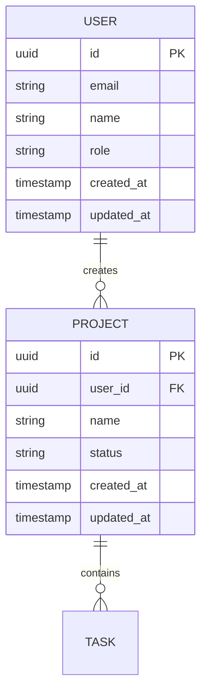

# Workflow: Design (Phase 5)

## Overview
Generates the core design artifacts from accumulated context: ERD (Mermaid), schema.sql (DDL),
PRD, and architecture decisions document. Consumes intake context and optionally research,
brand, and monetization data.

**CRITICAL: This workflow produces 4 artifacts in sequence. Do NOT skip any step.**
```
Step 2: ERD → Step 3: schema.sql → Step 4: PRD → Step 5: Architecture
```
Each step depends on the previous — the schema.sql translates the ERD, the PRD references
both, and the architecture doc ties everything together.

## Prerequisites
- `.kickstart/context.md` must exist
- `.kickstart/research.md` is optional but consumed if present
- `.kickstart/brand.md` is optional but consumed if present — pre-fills design tokens
- `.monetize/` artifacts are optional but consumed if present

## Steps

### Step 1: Load All Available Context

Read these files and merge into a unified understanding:

| File | Status | What to Extract |
|------|--------|----------------|
| `.kickstart/context.md` | **Required** | Domain model, user journey, auth, integrations, constraints |
| `.kickstart/brand.md` | Optional | Colors, typography, voice, UI preferences, design tokens |
| `.kickstart/research.md` | Optional | Stack recommendation, competitor gaps, market validation |
| `.monetize/context.md` | Optional | Business model signals |
| `.monetize/evaluation.md` | Optional | Recommended monetization model |
| `.monetize/research.md` | Optional | Pricing benchmarks, competitor pricing |

**If `.kickstart/brand.md` exists:**
- Use brand color palette for the ARCHITECTURE.md UI section
- Use brand typography choices for font recommendations
- Use brand voice guidelines for PRD writing style
- Use UI preferences (component library, design direction) for architecture decisions
- Copy the Design Tokens CSS block into the architecture doc's frontend section

### Step 2: Generate ERD

Create the Entity Relationship Diagram from the domain model in context.md.

**Output format:** Mermaid erDiagram syntax.

**Rules:**
- Include ALL entities from context.md Domain Model section
- Add relationship cardinality (1:1, 1:N, N:M)
- Include key properties as attributes
- Add a `created_at` and `updated_at` to all entities
- If auth model includes roles → add Role entity and User-Role relationship
- If multi-tenant → add Organization/Tenant entity
- If monetization data exists → add Subscription/Plan entities if applicable

**Example structure:**


Present the ERD to the user and ask for corrections before saving.

**DO NOT skip to the PRD.** The next step is schema.sql — it MUST run immediately after the ERD.

### Step 3: Generate schema.sql

**MANDATORY** — runs immediately after ERD confirmation. Do not skip this step.

Translate the ERD into executable DDL targeting the database chosen in the architecture decision.

**Input:**
- ERD from Step 2 (entities, fields, types, relationships)
- Database choice from `.kickstart/context.md` → Stack Preferences (or default to PostgreSQL)
- Data Rules from `.kickstart/context.md` → Domain Model (soft delete, encryption, audit trail)

**Database detection order:**
1. If `.kickstart/research.md` exists → check stack recommendation
2. If `.kickstart/context.md` has Stack Preferences → use that
3. Default → PostgreSQL (most common for modern web apps)

**Rules:**
- Use the target database's native types (e.g., `uuid`, `timestamptz`, `jsonb` for Postgres)
- Every table gets `id` (PK), `created_at`, `updated_at`
- Add `deleted_at` for entities marked as soft-delete in context.md
- Add foreign keys with appropriate `ON DELETE` behavior (CASCADE, SET NULL, RESTRICT)
- Add unique constraints from context.md Domain Model constraints
- Add indexes on foreign keys and fields marked as "indexed"
- N:M relationships get a join table with composite PK
- Include `CREATE INDEX` for fields likely to be queried (FKs, status, email)
- Add comments on non-obvious columns

**Dialect-specific patterns:**

| Database | PK Type | Timestamps | JSON | Notes |
|----------|---------|-----------|------|-------|
| PostgreSQL / Supabase | `uuid DEFAULT gen_random_uuid()` | `timestamptz DEFAULT now()` | `jsonb` | Add RLS policies if auth model is row-level |
| MySQL | `CHAR(36) DEFAULT (UUID())` | `TIMESTAMP DEFAULT CURRENT_TIMESTAMP` | `json` | Use `InnoDB` engine |
| SQLite | `TEXT` (uuid generated in app) | `TEXT DEFAULT (datetime('now'))` | `TEXT` (JSON stored as text) | No native UUID |

**Example output (PostgreSQL):**

```sql
-- schema.sql
-- Generated by /kickstart design phase
-- Target: PostgreSQL (Supabase)
-- Date: {date}

-- ============================================
-- Extensions
-- ============================================
CREATE EXTENSION IF NOT EXISTS "pgcrypto";

-- ============================================
-- Tables
-- ============================================

CREATE TABLE users (
    id          uuid PRIMARY KEY DEFAULT gen_random_uuid(),
    email       text UNIQUE NOT NULL,
    name        text NOT NULL,
    role        text NOT NULL DEFAULT 'user' CHECK (role IN ('user', 'admin')),
    created_at  timestamptz NOT NULL DEFAULT now(),
    updated_at  timestamptz NOT NULL DEFAULT now()
);

CREATE TABLE projects (
    id          uuid PRIMARY KEY DEFAULT gen_random_uuid(),
    user_id     uuid NOT NULL REFERENCES users(id) ON DELETE CASCADE,
    name        text NOT NULL,
    status      text NOT NULL DEFAULT 'active' CHECK (status IN ('active', 'archived')),
    created_at  timestamptz NOT NULL DEFAULT now(),
    updated_at  timestamptz NOT NULL DEFAULT now()
);

-- ============================================
-- Indexes
-- ============================================

CREATE INDEX idx_projects_user_id ON projects(user_id);
CREATE INDEX idx_users_email ON users(email);

-- ============================================
-- Triggers (updated_at)
-- ============================================

CREATE OR REPLACE FUNCTION update_updated_at()
RETURNS TRIGGER AS $$
BEGIN
    NEW.updated_at = now();
    RETURN NEW;
END;
$$ LANGUAGE plpgsql;

CREATE TRIGGER trg_users_updated_at
    BEFORE UPDATE ON users
    FOR EACH ROW EXECUTE FUNCTION update_updated_at();

CREATE TRIGGER trg_projects_updated_at
    BEFORE UPDATE ON projects
    FOR EACH ROW EXECUTE FUNCTION update_updated_at();
```

**If Supabase is the database**, also add:
- RLS policies if auth model requires row-level security
- A comment noting: `-- Apply via Supabase Dashboard > SQL Editor, or supabase migration new`

Present the schema.sql to the user and ask for corrections before saving.

**After schema.sql is confirmed, proceed immediately to the PRD.**

### Step 4: Generate PRD

Create a first-draft Product Requirements Document.

**Structure:**

```markdown
# PRD: {Project Name}

**Version:** 0.1 (kickstart draft)
**Date:** {date}
**Status:** Draft — generated by /kickstart, needs refinement

## Vision
{One paragraph — what this product is and why it matters}

## Problem Statement
{From context.md — the problem, who has it, current alternatives}

## Target Users
{User persona with demographics, goals, pain points}

## User Stories

### MVP User Stories
{Generate 5-8 user stories from the user journey in context.md}
| ID | As a... | I want to... | So that... | Priority |
|----|---------|-------------|------------|----------|
| US-01 | {role} | {action} | {benefit} | Must-have |
| US-02 | ... | ... | ... | Must-have |
| US-03 | ... | ... | ... | Should-have |

### Post-MVP User Stories
{3-5 stories for future iterations}

## Domain Model
{Summary of entities and relationships — reference ERD and schema.sql}

## Functional Requirements

### Core Features (MVP)
{Derived from must-have user stories}
1. **{Feature 1}** — {description}
2. **{Feature 2}** — {description}

### Future Features
{Derived from post-MVP stories and research gaps}

## Non-Functional Requirements
- **Performance:** {from constraints}
- **Security:** {from auth model + compliance}
- **Scalability:** {from scale expectations}
- **Accessibility:** {standard WCAG 2.1 AA unless specified}

## Technical Architecture
{High-level — detailed in ARCHITECTURE.md}
- **Stack:** {recommendation from research or user preference}
- **Auth:** {from context}
- **Integrations:** {from context}

## Monetization
{If monetize phase ran, summarize recommended model}
{If not, note "Monetization strategy not yet evaluated — run /monetize for analysis"}

## Success Metrics
{Derive 3-5 measurable KPIs from the problem statement and user journey}
| Metric | Target | How to Measure |
|--------|--------|---------------|
| {metric 1} | {target} | {method} |

## Open Questions
{List 3-5 things that need user decision or further research}

## Competitive Context
{If research phase ran, summarize key competitor insights}
{If not, note "Market research not yet conducted — run /kickstart with PERPLEXITY_API_KEY"}
```

### Step 5: Generate Architecture Document

```markdown
# Architecture Decisions: {Project Name}

**Generated:** {date}
**Status:** Draft — from /kickstart

## Stack Decision

| Layer | Choice | Rationale |
|-------|--------|-----------|
| **Frontend** | {framework} | {why — based on research + requirements} |
| **Backend** | {framework} | {why} |
| **Database** | {db} | {why — based on data model complexity} |
| **Auth** | {provider/method} | {why — based on auth model from intake} |
| **Hosting** | {platform} | {why — based on constraints} |
| **AI/ML** | {if applicable} | {why} |

## Architecture Pattern
{Monolith vs microservices vs serverless — justify based on team size, scale, complexity}

## Data Architecture
- **Primary database:** {choice + schema approach}
- **Caching:** {if needed}
- **File storage:** {if needed}
- **Search:** {if needed}

## API Architecture
- **Style:** {REST | GraphQL | tRPC — from context.md API Strategy}
- **Consumers:** {web frontend | mobile | third parties}
- **Base path:** {e.g., /api/v1/ for REST, /graphql for GraphQL}
- **Versioning:** {URL | header | none — based on public/internal}
- **Authentication:** {Bearer token | API key | Session — tied to auth architecture}
- **Error format:**
  ```json
  {
    "error": "{ERROR_CODE}",
    "message": "{human-readable message}",
    "details": [{field-level details}]
  }
  ```
- **Pagination:** {cursor-based | offset-based — choose based on data model}
- **Rate limiting:** {if public API: strategy and limits}

### Resource Map (from Domain Model)
| Resource | Operations | Auth | Notes |
|----------|-----------|------|-------|
| {entity from ERD} | CRUD | {auth level} | {special notes} |

This is the project-level API blueprint. Individual feature endpoints are designed during Discovery (surface) and Sprint (implementation detail).

## Integration Architecture
{For each integration from context.md:}
### {Integration Name}
- **Purpose:** {why}
- **Approach:** {SDK / REST API / webhook}
- **Data flow:** {what data moves where}

## Security Architecture
- **Authentication:** {detailed approach}
- **Authorization:** {RBAC / ABAC / simple}
- **Data protection:** {encryption at rest/transit, PII handling}
- **API security:** {rate limiting, API keys, CORS}

## Deployment Architecture
- **Environment strategy:** {dev/staging/prod}
- **CI/CD:** {approach}
- **Monitoring:** {approach}

## Key Trade-offs
{List 2-3 architectural decisions where alternatives were considered}
| Decision | Chosen | Alternative | Why |
|----------|--------|------------|-----|
| {decision 1} | {choice} | {alternative} | {rationale} |

## AI Concepts Referenced
{If the architecture involves AI components, explain the relevant concepts from the glossary:}
- **{Concept}:** {how it applies to this architecture}
```

### Step 6: Save All Artifacts

```bash
mkdir -p .kickstart/artifacts
```

Write:
- `.kickstart/artifacts/ERD.md` — Mermaid ERD
- `.kickstart/artifacts/schema.sql` — Database schema (target DB dialect)
- `.kickstart/artifacts/PRD.md` — Product Requirements Document
- `.kickstart/artifacts/ARCHITECTURE.md` — Architecture decisions

### Step 7: Report

```
Design artifacts generated:

  .kickstart/artifacts/PRD.md          — {N} user stories, {N} features
  .kickstart/artifacts/ERD.md          — {N} entities, {N} relationships
  .kickstart/artifacts/schema.sql      — {N} tables, {DB dialect} ({N} indexes)
  .kickstart/artifacts/ARCHITECTURE.md — Stack: {stack summary}

These are first drafts — refine them as you build.

Next: Handing off to /bootstrap to wire up your .claude/ ecosystem.
```

### Step 8: Validate & Report

**Validate:** Check that all 4 artifacts exist:
- `.kickstart/artifacts/PRD.md` — has `## User Stories` and `## Functional Requirements`
- `.kickstart/artifacts/ERD.md` — has valid Mermaid `erDiagram` block
- `.kickstart/artifacts/schema.sql` — has `CREATE TABLE` statements matching ERD entities
- `.kickstart/artifacts/ARCHITECTURE.md` — has `## Stack Decision` table and `## API Architecture` section

If any artifact is missing or incomplete, report which one failed and retry that specific artifact.

**Update state:**
```
Update .kickstart/state.md:
  Phase 5 (Design) → status: done, completed: {date}
  last_phase: 5
  last_phase_status: done
```

**Report:**
```
  [5] Design          ✅ done
      Output:
        .kickstart/artifacts/PRD.md           — {N} user stories, {N} features
        .kickstart/artifacts/ERD.md           — {N} entities, {N} relationships
        .kickstart/artifacts/schema.sql       — {N} tables, {DB dialect}
        .kickstart/artifacts/ARCHITECTURE.md  — Stack: {summary}
```

## Post-Conditions
- `.kickstart/artifacts/PRD.md` exists with user stories and requirements
- `.kickstart/artifacts/ERD.md` exists with valid Mermaid syntax
- `.kickstart/artifacts/schema.sql` exists with CREATE TABLE statements matching ERD
- `.kickstart/artifacts/ARCHITECTURE.md` exists with stack decision table
- `.kickstart/state.md` updated with Design → done
- User has reviewed the ERD and schema.sql
