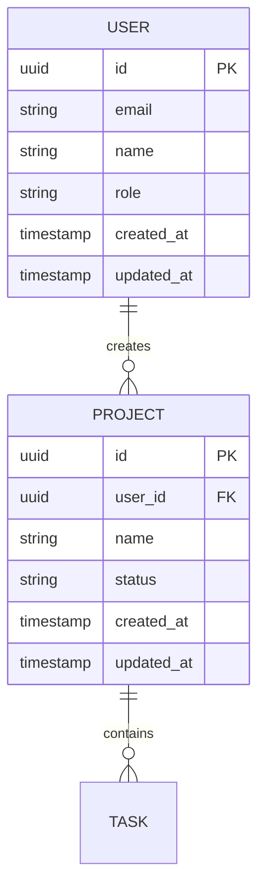

# Workflow: Design (Phase 5)

## Overview
Generates the core design artifacts from accumulated context: ERD (Mermaid), schema.sql (DDL),
PRD, API design (endpoints + contracts), and architecture decisions document. Consumes intake
context and optionally research, brand, and monetization data.

**CRITICAL: This workflow produces 5 artifacts in sequence. Do NOT skip any step.**
```
Step 2: ERD → Step 3: schema.sql → Step 4: PRD → Step 5: API Design → Step 6: Architecture
```
Each step depends on the previous — the schema.sql translates the ERD, the PRD references
both, the API design derives endpoints from the ERD + schema + PRD, and the architecture
doc ties everything together.

## Prerequisites
- `.kickstart/context.md` must exist
- `.kickstart/manifest.md` must exist (from Compose phase — even single-SP projects have one)
- `.kickstart/stack.md` must exist (from Stack Selection phase — explicit technology decisions)
- `.kickstart/research.md` is optional but consumed if present
- `.kickstart/brand.md` is optional but consumed if present — pre-fills design tokens
- `.monetize/` artifacts are optional but consumed if present

**Stack Integration:** Read `.kickstart/stack.md` at the start. Use its decisions to:
- Choose the correct database dialect for schema.sql (PostgreSQL, MySQL, SQLite, etc.)
- Set the API style in API.md (REST, GraphQL, tRPC — from stack preferences)
- Populate the Stack Decision table in ARCHITECTURE.md directly from stack.md
- Validate that design complexity matches the chosen platform (e.g., no complex schema for static sites)

## Multi-Sub-Project Mode

Read `.kickstart/manifest.md` at the start. Count sub-projects:

**If 1 sub-project:** Run Steps 2-7 normally, saving artifacts flat in `.kickstart/artifacts/`.
This is the current behavior — no changes needed.

**If 2+ sub-projects:**

1. **Generate shared artifacts first** in `.kickstart/artifacts/shared/`:
   - `AUTH.md` — shared auth design (from SC-XX entries in manifest)
   - `schema-shared.sql` — shared tables (users, orgs, roles — entities used by multiple SPs)
   - `CONTRACTS.md` — cross-project API contracts (from manifest's Contracts table)

2. **Then iterate over sub-projects in build order** from the manifest.
   For each sub-project, run Steps 2-7 saving artifacts to `.kickstart/artifacts/sp-{NN}-{name}/`:
   - `ERD.md` — entities relevant to this sub-project
   - `schema.sql` — tables for this sub-project (references shared schema)
   - `PRD.md` — features scoped to this sub-project
   - `API.md` — endpoints this sub-project exposes
   - `ARCHITECTURE.md` — stack and integration decisions for this sub-project

3. Each sub-project's artifacts **reference shared artifacts** and dependencies from the manifest.
   For example, the admin panel's API.md references the backend API's endpoints it consumes.

**Progress tracking in multi-SP mode:**
```
  [5] Design ▶ current
      Shared artifacts:     ✅ done (AUTH.md, schema-shared.sql, CONTRACTS.md)
      SP-01 Backend API:    ✅ done (5 artifacts)
      SP-02 Admin Panel:    ▶ current (3/5 artifacts)
      SP-03 Frontend App:   ○ pending
```

## Steps

**Log:** `bash ${CLAUDE_PLUGIN_ROOT}/scripts/cks-log.sh INFO "kickstart.phase.started" "_project" "Kickstart Phase 5: Design" '{"phase_number":"5","phase_name":"Design"}'`

### Step 1: Load All Available Context

Read these files and merge into a unified understanding:

| File | Status | What to Extract |
|------|--------|----------------|
| `.kickstart/context.md` | **Required** | Domain model, user journey, auth, integrations, constraints |
| `.kickstart/manifest.md` | **Required** | Sub-projects, dependencies, build order, shared concerns, contracts |
| `.kickstart/brand.md` | Optional | Colors, typography, voice, UI preferences, design tokens |
| `.kickstart/research.md` | Optional | Stack recommendation, competitor gaps, market validation |
| `.monetize/context.md` | Optional | Business model signals |
| `.monetize/evaluation.md` | Optional | Recommended monetization model |
| `.monetize/research.md` | Optional | Pricing benchmarks, competitor pricing |

**If `.kickstart/brand.md` exists:**
- Use brand color palette for the ARCHITECTURE.md UI section
- Use brand typography choices for font recommendations
- Use brand voice guidelines for PRD writing style
- Use UI preferences (component library, design direction) for architecture decisions
- Copy the Design Tokens CSS block into the architecture doc's frontend section

### Step 2: Generate ERD

Display: `[5a] ERD ▶ current`

Create the Entity Relationship Diagram from the domain model in context.md.

**Output format:** Mermaid erDiagram syntax.

**Rules:**
- Include ALL entities from context.md Domain Model section
- Add relationship cardinality (1:1, 1:N, N:M)
- Include key properties as attributes
- Add a `created_at` and `updated_at` to all entities
- If auth model includes roles → add Role entity and User-Role relationship
- If multi-tenant → add Organization/Tenant entity
- If monetization data exists → add Subscription/Plan entities if applicable

**Example structure:**


Present the ERD to the user and ask for corrections before saving.

**After saving ERD.md:**
- Update `state.md`: Design: ERD → `done`
- Display: `[5a] ERD ✅ done`

---

### GATE CHECK: ERD → Schema

Before proceeding, verify `.kickstart/artifacts/ERD.md` exists. If it does not exist, STOP and go back to Step 2.

**DO NOT skip to the PRD.** The next step is schema.sql — it MUST run immediately after the ERD.

---

### Step 3: Generate schema.sql

Display: `[5b] Schema ▶ current`

**MANDATORY** — runs immediately after ERD confirmation. Do not skip this step.

Translate the ERD into executable DDL targeting the database chosen in the architecture decision.

**Input:**
- ERD from Step 2 (entities, fields, types, relationships)
- Database choice from `.kickstart/context.md` → Stack Preferences (or default to PostgreSQL)
- Data Rules from `.kickstart/context.md` → Domain Model (soft delete, encryption, audit trail)

**Database detection order:**
1. If `.kickstart/research.md` exists → check stack recommendation
2. If `.kickstart/context.md` has Stack Preferences → use that
3. Default → PostgreSQL (most common for modern web apps)

**Rules:**
- Use the target database's native types (e.g., `uuid`, `timestamptz`, `jsonb` for Postgres)
- Every table gets `id` (PK), `created_at`, `updated_at`
- Add `deleted_at` for entities marked as soft-delete in context.md
- Add foreign keys with appropriate `ON DELETE` behavior (CASCADE, SET NULL, RESTRICT)
- Add unique constraints from context.md Domain Model constraints
- Add indexes on foreign keys and fields marked as "indexed"
- N:M relationships get a join table with composite PK
- Include `CREATE INDEX` for fields likely to be queried (FKs, status, email)
- Add comments on non-obvious columns

**Dialect-specific patterns:**

| Database | PK Type | Timestamps | JSON | Notes |
|----------|---------|-----------|------|-------|
| PostgreSQL / Supabase | `uuid DEFAULT gen_random_uuid()` | `timestamptz DEFAULT now()` | `jsonb` | Add RLS policies if auth model is row-level |
| MySQL | `CHAR(36) DEFAULT (UUID())` | `TIMESTAMP DEFAULT CURRENT_TIMESTAMP` | `json` | Use `InnoDB` engine |
| SQLite | `TEXT` (uuid generated in app) | `TEXT DEFAULT (datetime('now'))` | `TEXT` (JSON stored as text) | No native UUID |

**Example output (PostgreSQL):**

```sql
-- schema.sql
-- Generated by /kickstart design phase
-- Target: PostgreSQL (Supabase)
-- Date: {date}

-- ============================================
-- Extensions
-- ============================================
CREATE EXTENSION IF NOT EXISTS "pgcrypto";

-- ============================================
-- Tables
-- ============================================

CREATE TABLE users (
    id          uuid PRIMARY KEY DEFAULT gen_random_uuid(),
    email       text UNIQUE NOT NULL,
    name        text NOT NULL,
    role        text NOT NULL DEFAULT 'user' CHECK (role IN ('user', 'admin')),
    created_at  timestamptz NOT NULL DEFAULT now(),
    updated_at  timestamptz NOT NULL DEFAULT now()
);

CREATE TABLE projects (
    id          uuid PRIMARY KEY DEFAULT gen_random_uuid(),
    user_id     uuid NOT NULL REFERENCES users(id) ON DELETE CASCADE,
    name        text NOT NULL,
    status      text NOT NULL DEFAULT 'active' CHECK (status IN ('active', 'archived')),
    created_at  timestamptz NOT NULL DEFAULT now(),
    updated_at  timestamptz NOT NULL DEFAULT now()
);

-- ============================================
-- Indexes
-- ============================================

CREATE INDEX idx_projects_user_id ON projects(user_id);
CREATE INDEX idx_users_email ON users(email);

-- ============================================
-- Triggers (updated_at)
-- ============================================

CREATE OR REPLACE FUNCTION update_updated_at()
RETURNS TRIGGER AS $$
BEGIN
    NEW.updated_at = now();
    RETURN NEW;
END;
$$ LANGUAGE plpgsql;

CREATE TRIGGER trg_users_updated_at
    BEFORE UPDATE ON users
    FOR EACH ROW EXECUTE FUNCTION update_updated_at();

CREATE TRIGGER trg_projects_updated_at
    BEFORE UPDATE ON projects
    FOR EACH ROW EXECUTE FUNCTION update_updated_at();
```

**If Supabase is the database**, also add:
- RLS policies if auth model requires row-level security
- A comment noting: `-- Apply via Supabase Dashboard > SQL Editor, or supabase migration new`

Present the schema.sql to the user and ask for corrections before saving.

**After saving schema.sql:**
- Update `state.md`: Design: Schema → `done`
- Display: `[5b] Schema ✅ done`

---

### GATE CHECK: Schema → PRD

Before proceeding, verify `.kickstart/artifacts/schema.sql` exists. If it does not exist, STOP and go back to Step 3.

---

### Step 4: Generate PRD

Display: `[5c] PRD ▶ current`

Create a first-draft Product Requirements Document.

**Structure:**

```markdown
# PRD: {Project Name}

**Version:** 0.1 (kickstart draft)
**Date:** {date}
**Status:** Draft — generated by /kickstart, needs refinement

## Vision
{One paragraph — what this product is and why it matters}

## Problem Statement
{From context.md — the problem, who has it, current alternatives}

## Target Users
{User persona with demographics, goals, pain points}

## User Stories

### MVP User Stories
{Generate 5-8 user stories from the user journey in context.md}
| ID | As a... | I want to... | So that... | Priority |
|----|---------|-------------|------------|----------|
| US-01 | {role} | {action} | {benefit} | Must-have |
| US-02 | ... | ... | ... | Must-have |
| US-03 | ... | ... | ... | Should-have |

### Post-MVP User Stories
{3-5 stories for future iterations}

## Domain Model
{Summary of entities and relationships — reference ERD and schema.sql}

## Functional Requirements

### Core Features (MVP)
{Derived from must-have user stories}
1. **{Feature 1}** — {description}
2. **{Feature 2}** — {description}

### Future Features
{Derived from post-MVP stories and research gaps}

## Non-Functional Requirements
- **Performance:** {from constraints}
- **Security:** {from auth model + compliance}
- **Scalability:** {from scale expectations}
- **Accessibility:** {standard WCAG 2.1 AA unless specified}

## Technical Architecture
{High-level — detailed in ARCHITECTURE.md}
- **Stack:** {recommendation from research or user preference}
- **Auth:** {from context}
- **Integrations:** {from context}

## Monetization Model

If `.monetize/evaluation.md` exists, read it and summarize:
- **Revenue Model:** {recommended model from evaluation — e.g., Freemium, SaaS subscription}
- **Pricing Strategy:** {pricing tiers or approach from evaluation}
- **Key Revenue Features:** {which features unlock revenue — from evaluation}
- **Feature Gating:** {which features are free vs paid — if applicable}

If `.monetize/evaluation.md` does NOT exist but `.kickstart/context.md` has `## Business & Monetization`:
- **Revenue Model:** {from intake Q14}
- **Business Stage:** {from intake Q13}
- **Note:** "Full monetization analysis not conducted — run /cks:monetize for detailed strategy"

If neither exists:
- "Monetization strategy not yet evaluated — run /cks:monetize for analysis"

## Success Metrics
{Derive 3-5 measurable KPIs from the problem statement and user journey}
| Metric | Target | How to Measure |
|--------|--------|---------------|
| {metric 1} | {target} | {method} |

## Open Questions
{List 3-5 things that need user decision or further research}

## Competitive Context
{If research phase ran, summarize key competitor insights}
{If not, note "Market research not yet conducted — run /kickstart with PERPLEXITY_API_KEY"}
```

**After saving PRD.md:**
- Update `state.md`: Design: PRD → `done`
- Display: `[5c] PRD ✅ done`

---

### GATE CHECK: PRD → API Design

Before proceeding, verify `.kickstart/artifacts/PRD.md` exists. If it does not exist, STOP and go back to Step 4.

---

### Step 5: Generate API Design

**Project type detection (determines contract format):**

Read `.kickstart/context.md` → `## What Are You Building` → `Type:` field.

| Project Type | Contract Format | Template Used |
|-------------|----------------|---------------|
| Web application | REST/GraphQL/tRPC API contract | REST/GraphQL/tRPC template (below) |
| Backend API / microservice | REST/GraphQL/tRPC API contract | REST/GraphQL/tRPC template (below) |
| Mobile app | REST/GraphQL API contract | REST/GraphQL/tRPC template (below) |
| AI agent / automation | MCP Tool Definitions | MCP template (below) |
| CLI tool | CLI Command Reference | CLI template (below) |
| Library / SDK | Public API Surface | Library template (below) |
| Claude Code plugin | Plugin Manifest Spec | Plugin template (below) |
| Website | Skip API Design | No contract needed — skip to Step 6 |

**Routing logic:**
1. Read the `Type:` value from context.md
2. If `Website` or `content-focused, mostly static`:
   - Display `[5d] API Design ⏭ N/A (static site)`
   - Update `state.md`: Design: API Design → `skipped`
   - Skip to Step 6 (Architecture) — do NOT check for API.md in the gate check
3. If `AI agent` or `automation` → use MCP Tool Definitions template
4. If `CLI tool` → use CLI Command Reference template
5. If `Library / SDK` → use Public API Surface template
6. If project has `.claude-plugin/` directory → use Plugin Manifest Spec template
7. Otherwise → fall through to the REST/GraphQL/tRPC template below

---

**If project type is Web application, Backend API, Mobile app, or Microservice (REST/GraphQL/tRPC contract):**

Display: `[5d] API Design ▶ current`

Derive a complete API contract from the ERD entities, schema.sql tables, PRD features, and
the API Strategy section of `.kickstart/context.md`.

**Input:**
- ERD from Step 2 (entities + relationships → resources + nested routes)
- schema.sql from Step 3 (column names/types → request/response field names/types)
- PRD from Step 4 (features → which operations are MVP vs future)
- `.kickstart/context.md` → API Strategy (style, consumers, public/private)
- `.kickstart/context.md` → Authentication & Authorization (auth model → auth requirements per endpoint)

**API style detection order:**
1. If `.kickstart/context.md` has API Strategy → Style → use that
2. If `.kickstart/research.md` has stack recommendation with API style → use that
3. Default → REST (most common for modern web apps)

**Rules:**
- One section per resource (entity from ERD)
- Every entity with a table in schema.sql gets at minimum: List, Get, Create
- Add Update and Delete based on PRD requirements (soft-delete entities use archive/restore instead of DELETE)
- Include request body fields derived from schema.sql columns (exclude auto-generated: id, created_at, updated_at)
- Include response shape with all columns from schema.sql
- Mark auth level per endpoint (public, authenticated, role-based, owner-only)
- Flag MVP endpoints vs post-MVP based on PRD priorities
- For N:M relationships, document the association endpoints (add/remove)
- Include pagination parameters for list endpoints
- Include filter/search parameters where the schema has indexes

**Structure (REST example):**

```markdown
# API Design: {Project Name}

**Version:** 0.1 (kickstart draft)
**Date:** {date}
**Status:** Draft — generated by /kickstart, refined during sprint
**Style:** {REST | GraphQL | tRPC}
**Base URL:** {/api/v1 | /graphql | /trpc}

## Conventions

- **Authentication:** {Bearer token | API key | Session cookie} — from auth model
- **Content-Type:** application/json
- **Error format:**
  ```json
  {
    "error": "ERROR_CODE",
    "message": "Human-readable description",
    "details": [{"field": "email", "issue": "already exists"}]
  }
  ```
- **Pagination:** {cursor | offset} — `?cursor=xxx&limit=20` or `?page=1&per_page=20`
- **Timestamps:** ISO 8601 (UTC)
- **IDs:** UUID v4

## Endpoints

### {Resource: e.g., Users}

> Source: `users` table (schema.sql) | `USER` entity (ERD)
> MVP: {Yes | Partial | No}

| Method | Path | Auth | Description | Status |
|--------|------|------|-------------|--------|
| GET | /{resources} | {auth level} | List with pagination + filters | MVP |
| GET | /{resources}/:id | {auth level} | Get by ID | MVP |
| POST | /{resources} | {auth level} | Create | MVP |
| PATCH | /{resources}/:id | {auth level} | Update fields | MVP |
| DELETE | /{resources}/:id | {auth level} | {Delete | Archive} | {MVP | Post-MVP} |

**Create — Request body:**
```json
{
  "email": "string (required, unique)",
  "name": "string (required)",
  "role": "string (optional, default: 'user', enum: ['user', 'admin'])"
}
```

**Response (single):**
```json
{
  "id": "uuid",
  "email": "string",
  "name": "string",
  "role": "string",
  "created_at": "ISO 8601",
  "updated_at": "ISO 8601"
}
```

**Response (list):**
```json
{
  "data": [{ ...resource }],
  "pagination": {
    "cursor": "string | null",
    "has_more": "boolean",
    "total": "number (if offset-based)"
  }
}
```

**Filters:** `?role=admin&search=email:john`

### {Resource: e.g., Projects}

> Source: `projects` table (schema.sql) | `PROJECT` entity (ERD)
> Parent: `users` (FK: user_id)
> MVP: Yes

| Method | Path | Auth | Description | Status |
|--------|------|------|-------------|--------|
| GET | /users/:user_id/{resources} | owner | List user's resources | MVP |
| GET | /{resources}/:id | authenticated | Get by ID | MVP |
| POST | /{resources} | authenticated | Create (user_id from auth) | MVP |
| PATCH | /{resources}/:id | owner | Update fields | MVP |
| DELETE | /{resources}/:id | owner | Archive (soft-delete) | MVP |

{... request/response bodies derived from schema.sql columns ...}

## Webhook Events (if applicable)
{If integrations require webhooks, list the events this API emits}

| Event | Trigger | Payload |
|-------|---------|---------|
| {resource}.created | POST /{resource} | Full resource object |
| {resource}.updated | PATCH /{resource}/:id | Changed fields + resource ID |

## Rate Limits
{If public API or from context.md constraints}

| Tier | Limit | Window |
|------|-------|--------|
| Authenticated | {N} req | per minute |
| Public (if any) | {N} req | per minute |

## Status Codes

| Code | Meaning | When |
|------|---------|------|
| 200 | OK | Successful GET, PATCH |
| 201 | Created | Successful POST |
| 204 | No Content | Successful DELETE |
| 400 | Bad Request | Validation error |
| 401 | Unauthorized | Missing/invalid auth |
| 403 | Forbidden | Insufficient permissions |
| 404 | Not Found | Resource doesn't exist |
| 409 | Conflict | Duplicate (unique constraint) |
| 422 | Unprocessable | Business rule violation |
| 429 | Too Many Requests | Rate limit exceeded |

## Open Questions
{API-specific decisions that need user input — versioning strategy, webhook needs, etc.}
```

**If GraphQL was chosen** instead of REST, use this structure:
- Types section (derived from schema.sql → GraphQL types)
- Queries section (list + get per entity)
- Mutations section (create, update, delete per entity)
- Subscriptions section (if real-time needed from context.md)
- Include field-level auth annotations

**If tRPC was chosen**, use this structure:
- Router definitions per entity
- Procedure types (query, mutation)
- Input/output Zod schemas derived from schema.sql columns

---

**If project type is AI agent / automation (MCP Tool Definitions):**

Display: `[5d] API Design ▶ current (MCP Tool Definitions)`

**Input:**
- ERD from Step 2 (entities → tools that operate on them)
- PRD from Step 4 (features → which tools are MVP)
- `.kickstart/context.md` → Integrations (what external systems tools connect to)

Generate `API.md` using this structure:

```markdown
# MCP Tool Definitions: {Project Name}

**Version:** 0.1 (kickstart draft)
**Date:** {date}
**Status:** Draft — generated by /kickstart, refined during sprint
**Protocol:** Model Context Protocol (MCP)
**Transport:** {stdio | SSE | HTTP — from context.md integrations}

## Server Info
- **Name:** {kebab-case project name}
- **Description:** {one-line from PRD}
- **Version:** 0.1.0

## Tools

### {tool_name}
> Source: {entity from ERD or feature from PRD}
> MVP: {Yes | No}

**Description:** {What this tool does — written for LLM consumption, be specific}

**Input Schema:**
```json
{
  "type": "object",
  "properties": {
    "{param}": {
      "type": "{string|number|boolean|array|object}",
      "description": "{what this param does — LLMs read this}"
    }
  },
  "required": ["{param}"]
}
```

**Output:** {description of what the tool returns}

**Example:**
```json
// Input
{"param": "example_value"}

// Output
{"result": "example_output"}
```

**Error Cases:**
| Error | When | Response |
|-------|------|----------|
| INVALID_INPUT | Required param missing | `{"error": "Missing required: {param}"}` |
| NOT_FOUND | Resource doesn't exist | `{"error": "{resource} not found"}` |

{repeat for each tool}

## Resources (if applicable)
{MCP resources the server exposes — static or dynamic data}

| URI Pattern | Description | MIME Type |
|------------|-------------|-----------|
| {uri} | {what it provides} | {type} |

## Prompts (if applicable)
{MCP prompts the server provides}

| Name | Description | Arguments |
|------|-------------|-----------|
| {prompt_name} | {what it does} | {arg}: {description} |

## Configuration
- **Environment Variables:**
  | Variable | Purpose | Required |
  |----------|---------|----------|
  | {VAR} | {purpose} | {yes/no} |

## Open Questions
{MCP-specific decisions: transport choice, resource design, prompt templates}
```

---

**If project type is CLI tool (CLI Command Reference):**

Display: `[5d] API Design ▶ current (CLI Command Reference)`

**Input:**
- PRD from Step 4 (features → commands)
- `.kickstart/context.md` → User Journey (workflow → command sequence)

Generate `API.md` using this structure:

```markdown
# CLI Command Reference: {Project Name}

**Version:** 0.1 (kickstart draft)
**Date:** {date}
**Status:** Draft — generated by /kickstart, refined during sprint
**Binary:** {binary name — kebab-case project name}

## Global Options
| Flag | Short | Description | Default |
|------|-------|-------------|---------|
| --help | -h | Show help | — |
| --version | -V | Show version | — |
| --verbose | -v | Verbose output | false |
| {flag} | {short} | {description} | {default} |

## Commands

### {command_name}
> Source: {feature from PRD}
> MVP: {Yes | No}

**Usage:** `{binary} {command} [options] <args>`

**Description:** {what this command does}

**Arguments:**
| Name | Type | Required | Description |
|------|------|----------|-------------|
| {arg} | {type} | {yes/no} | {description} |

**Options:**
| Flag | Short | Type | Default | Description |
|------|-------|------|---------|-------------|
| {flag} | {short} | {type} | {default} | {description} |

**Examples:**
```bash
# Basic usage
{binary} {command} value

# With options
{binary} {command} --flag value
```

**Exit Codes:**
| Code | Meaning |
|------|---------|
| 0 | Success |
| 1 | General error |
| 2 | Invalid arguments |

{repeat for each command}

## Configuration File
- **Location:** `~/.{binary}/config.{toml|json|yaml}` or `.{binary}rc`

## Environment Variables
| Variable | Purpose | Required |
|----------|---------|----------|
| {VAR} | {purpose} | {yes/no} |

## Open Questions
{CLI-specific decisions: config format, shell completions, interactive mode}
```

---

**If project type is Library / SDK (Public API Surface):**

Display: `[5d] API Design ▶ current (Public API Surface)`

**Input:**
- ERD from Step 2 (entities → exported types/interfaces)
- schema.sql from Step 3 (field types → parameter types)
- PRD from Step 4 (features → public functions)
- `.kickstart/stack.md` → Language (determines syntax)

Generate `API.md` using this structure:

```markdown
# Public API Surface: {Project Name}

**Version:** 0.1 (kickstart draft)
**Date:** {date}
**Status:** Draft — generated by /kickstart, refined during sprint
**Package:** {package name from context}
**Language:** {from stack.md}

## Installation
```bash
{package manager} install {package-name}
```

## Exports

### {module/namespace}
> Source: {entity from ERD or feature from PRD}
> MVP: {Yes | No}

#### `{functionName}({params}): {returnType}`

**Description:** {what this function does}

**Parameters:**
| Name | Type | Required | Default | Description |
|------|------|----------|---------|-------------|
| {param} | {type} | {yes/no} | {default} | {description} |

**Returns:** `{type}` — {description}

**Throws:**
| Error | When |
|-------|------|
| {ErrorType} | {condition} |

**Example:**
```{language}
import { functionName } from '{package-name}'

const result = functionName(input)
```

{repeat for each export}

## Types / Interfaces
```{language}
{key type definitions that consumers need}
```

## Configuration
| Option | Type | Default | Description |
|--------|------|---------|-------------|
| {option} | {type} | {default} | {description} |

## Versioning & Compatibility
- **Semver:** {major.minor.patch strategy}
- **Breaking changes:** {policy}
- **Min runtime:** {Node >= 18, Python >= 3.10, etc.}

## Open Questions
{Library-specific decisions: tree-shaking, ESM/CJS, peer deps}
```

---

**If project type is Claude Code plugin (Plugin Manifest Spec):**

Display: `[5d] API Design ▶ current (Plugin Manifest Spec)`

**Input:**
- PRD from Step 4 (features → commands, agents)
- `.kickstart/context.md` → User Journey (workflow → command flow)

Generate `API.md` using this structure:

```markdown
# Plugin Manifest Spec: {Project Name}

**Version:** 0.1 (kickstart draft)
**Date:** {date}
**Status:** Draft — generated by /kickstart, refined during sprint

## plugin.json
```json
{
  "name": "{plugin-name}",
  "description": "{one-liner}",
  "version": "0.1.0"
}
```

## Commands
| Command | Description | Allowed Tools |
|---------|-------------|---------------|
| /{prefix}:{name} | {what it does} | {tools} |

{For each command:}
### /{prefix}:{name}
- **Description:** {user-facing description}
- **Arguments:** {positional args if any}
- **Dispatches:** {agent name} agent
- **User interaction:** {AskUserQuestion patterns}

## Agents
| Agent | Model | Description | Skills |
|-------|-------|-------------|--------|
| {name} | {sonnet|opus} | {what it does} | {skill list} |

## Skills
| Skill | Description | Workflows |
|-------|-------------|-----------|
| {name} | {domain expertise} | {workflow files} |

## Hooks
| Event | Handler | Purpose |
|-------|---------|---------|
| {SessionStart|PreToolUse|etc.} | {script} | {what it guards/automates} |

## MCP Servers (if any)
| Server | Transport | Purpose |
|--------|-----------|---------|
| {name} | {stdio|sse} | {what it provides} |

## Open Questions
{Plugin-specific decisions: command naming, agent model choices, hook strategy}
```

---

Present the API design to the user and ask for corrections before saving.

**After saving API.md:**
- Update `state.md`: Design: API Design → `done`
- Display: `[5d] API Design ✅ done`

---

### GATE CHECK: API Design → Architecture

Before proceeding:
- If project type was `Website` (Step 5 was skipped) → proceed directly to Step 6
- Otherwise → verify `.kickstart/artifacts/API.md` exists. If it does not exist, STOP and go back to Step 5.

---

### Step 6: Generate Architecture Document

Display: `[5e] Architecture ▶ current`

```markdown
# Architecture Decisions: {Project Name}

**Generated:** {date}
**Status:** Draft — from /kickstart

## Stack Decision

**Source:** Read `.kickstart/stack.md` for explicit user decisions. Populate this table from those decisions — do NOT guess or override user choices.

| Layer | Choice | Rationale |
|-------|--------|-----------|
| **Frontend** | {from stack.md or context} | {why — user choice + fit for project} |
| **Backend** | {from stack.md or context} | {why} |
| **Database** | {from stack.md or context} | {why — fits data model complexity} |
| **Auth** | {provider/method} | {why — based on auth model from intake} |
| **Hosting** | {from stack.md or context} | {why — based on constraints} |
| **CI/CD** | {from stack.md} | {why} |
| **AI/ML** | {if applicable} | {why} |

## Architecture Pattern
{Monolith vs microservices vs serverless — justify based on team size, scale, complexity}

## Data Architecture
- **Primary database:** {choice + schema approach}
- **Caching:** {if needed}
- **File storage:** {if needed}
- **Search:** {if needed}

## API Architecture

> Full endpoint contract: see `.kickstart/artifacts/API.md`

- **Style:** {REST | GraphQL | tRPC — from API.md}
- **Consumers:** {web frontend | mobile | third parties}
- **Base path:** {from API.md}
- **Versioning:** {from API.md}
- **Endpoint count:** {N} MVP endpoints across {N} resources

### Resource Summary (from API.md)
| Resource | MVP Endpoints | Auth Model | Notes |
|----------|--------------|------------|-------|
| {entity} | {N} | {auth level} | {special notes} |

Detailed request/response contracts, filters, pagination, rate limits, and status codes
are defined in `API.md`. This section provides the architectural summary only.

## Integration Architecture
{For each integration from context.md:}
### {Integration Name}
- **Purpose:** {why}
- **Approach:** {SDK / REST API / webhook}
- **Data flow:** {what data moves where}

## Security Architecture
- **Authentication:** {detailed approach}
- **Authorization:** {RBAC / ABAC / simple}
- **Data protection:** {encryption at rest/transit, PII handling}
- **API security:** {rate limiting, API keys, CORS}

## Deployment Architecture
- **Environment strategy:** {dev/staging/prod}
- **CI/CD:** {approach}
- **Monitoring:** {approach}

## Key Trade-offs
{List 2-3 architectural decisions where alternatives were considered}
| Decision | Chosen | Alternative | Why |
|----------|--------|------------|-----|
| {decision 1} | {choice} | {alternative} | {rationale} |

## AI Concepts Referenced
{If the architecture involves AI components, explain the relevant concepts from the glossary:}
- **{Concept}:** {how it applies to this architecture}
```

### Step 7: Save Architecture & Final Update

**Note:** ERD, schema.sql, PRD, and API.md should already be saved by their respective steps above. This step saves the Architecture document.

```bash
mkdir -p .kickstart/artifacts
```

Write `.kickstart/artifacts/ARCHITECTURE.md`.

**After saving:**
- Update `state.md`: Design: Architecture → `done`
- Display: `[5e] Architecture ✅ done`

### Step 8: Final Validation & Report

**Log:** `bash ${CLAUDE_PLUGIN_ROOT}/scripts/cks-log.sh INFO "kickstart.phase.completed" "_project" "Kickstart Phase 5 complete" '{"phase_number":"5"}'`

**CRITICAL: Verify ALL 5 artifacts exist before reporting Design as done.**

Check each file. If any is missing, identify which sub-step failed and retry ONLY that sub-step:

| Sub-step | File | Validation |
|----------|------|-----------|
| 5a | `.kickstart/artifacts/ERD.md` | Has valid `erDiagram` block |
| 5b | `.kickstart/artifacts/schema.sql` | Has `CREATE TABLE` statements matching ERD entities |
| 5c | `.kickstart/artifacts/PRD.md` | Has `## User Stories` and `## Functional Requirements` |
| 5d | `.kickstart/artifacts/API.md` | Has contract section matching project type (Endpoints, Tools, Commands, Exports, or Manifest) — OR status `skipped` for websites |
| 5e | `.kickstart/artifacts/ARCHITECTURE.md` | Has `## Stack Decision` table and `## API Architecture` section |

**Common failures:**
- **schema.sql missing:** Go back to Step 3 and generate it from the ERD.
- **API.md missing:** Go back to Step 5 and generate it from ERD + schema.sql + PRD.

**Update state:**
```
Update .kickstart/state.md:
  All Design sub-steps (5a–5e) → status: done, completed: {date}
  last_phase: 5
  last_phase_status: done
```

**Report:**
```
  [5] Design          ✅ done
      [5a] ERD             ✅ .kickstart/artifacts/ERD.md — {N} entities
      [5b] Schema          ✅ .kickstart/artifacts/schema.sql — {N} tables, {DB dialect}
      [5c] PRD             ✅ .kickstart/artifacts/PRD.md — {N} user stories
      [5d] API Design      ✅ .kickstart/artifacts/API.md — {N} endpoints, {API style}
      [5e] Architecture    ✅ .kickstart/artifacts/ARCHITECTURE.md — {summary}

  Next: Handing off to /bootstrap to wire up your .claude/ ecosystem.
```

## Post-Conditions
- `.kickstart/artifacts/ERD.md` exists with valid Mermaid syntax
- `.kickstart/artifacts/schema.sql` exists with CREATE TABLE statements matching ERD
- `.kickstart/artifacts/PRD.md` exists with user stories and requirements
- `.kickstart/artifacts/API.md` exists with endpoint tables and request/response contracts
- `.kickstart/artifacts/ARCHITECTURE.md` exists with stack decision table
- `.kickstart/state.md` updated with all Design sub-steps (5a–5e) → done
- User has reviewed the ERD, schema.sql, and API.md
