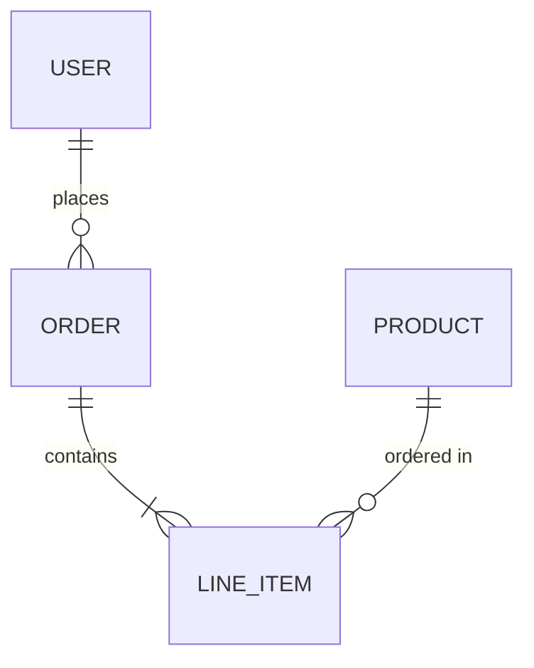
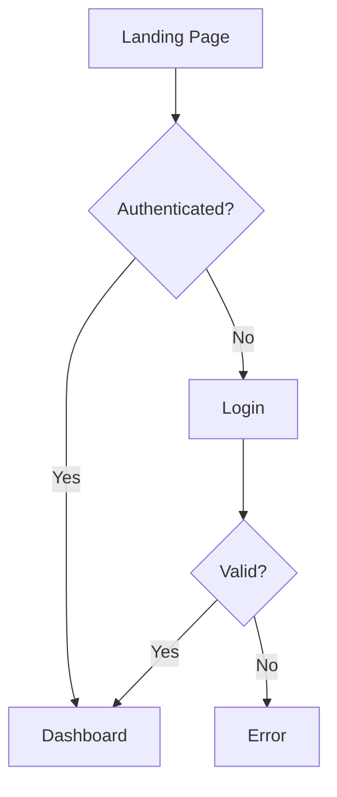
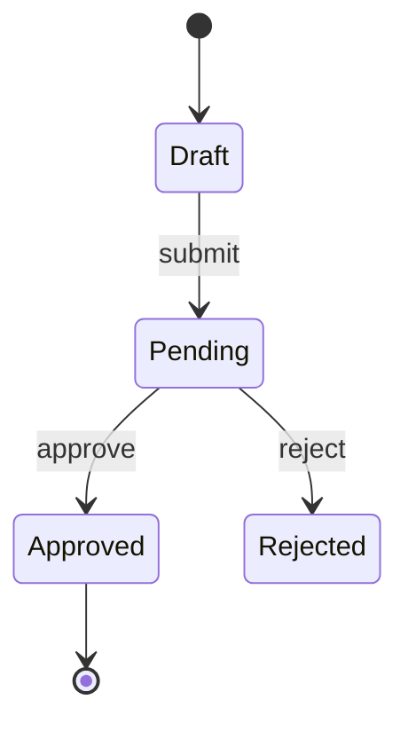
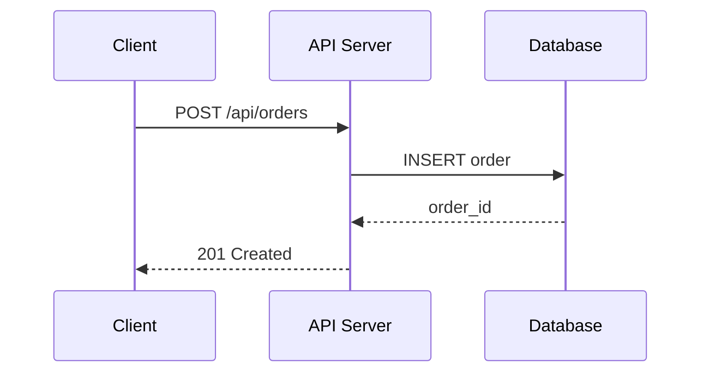

# Design Tools Reference

## Tool Separation

| Purpose | Primary Tool | Output | Fallback |
|---------|-------------|--------|----------|
| **UI mockups / app screens** | Stitch MCP | HTML + screenshots | Text-based wireframe descriptions |
| **ERD, flowcharts, sequence, state diagrams** | Mermaid `.mmd` → `mmdc` render | `.mmd` source + `.svg` rendered | Mermaid syntax in markdown |
| **Architecture diagrams, wireframes** | Excalidraw MCP (`create_view`) | Inline visual + `.excalidraw` JSON | Mermaid `.mmd` → `.svg` |
| **Inline visual review** | Excalidraw MCP (`create_view`) | Hand-drawn animated diagram in Claude Code | — |

## UI Mockups — Stitch MCP

Stitch MCP generates application and web UI mockups from natural language prompts.

> **Requires configuration.** If Stitch MCP is not available, skip screen generation and produce text-based wireframe descriptions + component specs instead. Do NOT use Canva, Excalidraw, or Mermaid for app mockups — they are not suited for this.

**Screen generation prompt pattern:**

If `DESIGN.md` exists, include its tokens in every Stitch prompt:
```
Create a {screen_type} for {app_description}.

User story: {user_story}

This screen should:
- {acceptance_criterion_1}
- {acceptance_criterion_2}

Layout: {mobile_first | desktop_first}
Style: {modern minimal | data-dense | marketing | dashboard}

Design system (from DESIGN.md):
- Colors: {paste Color Palette section — primary, surface, text, accent hex values}
- Typography: {paste font families and key sizes}
- Components: {paste relevant component specs — buttons, cards, inputs}
- Spacing: {base unit and scale}
- Do's: {paste key Do's}
- Don'ts: {paste key Don'ts}
```

If no `DESIGN.md` exists, use the simpler pattern:
```
Create a {screen_type} for {app_description}.

User story: {user_story}

This screen should:
- {acceptance_criterion_1}
- {acceptance_criterion_2}

Layout: {mobile_first | desktop_first}
Style: {modern minimal | data-dense | marketing | dashboard}
```

**Screen editing prompt pattern:**
```
Edit this screen: {edit_instruction_from_user_feedback}
```

**Device variant generation:**
```
Generate a mobile variant of this screen
Generate a tablet variant of this screen
```

## Technical Diagrams — Mermaid + mmdc Rendering

Use Mermaid syntax for all structured diagrams. **Always render to SVG files** using the `mmdc` CLI so the design phase produces actual visual artifacts, not just code blocks.

### Rendering workflow

1. **Write** Mermaid source to `.mmd` file in `design/diagrams/`
2. **Render** to SVG using mmdc:
   ```bash
   npx -y @mermaid-js/mermaid-cli -i "{diagram}.mmd" -o "{diagram}.svg" -b transparent
   ```
3. **Review inline** using Excalidraw `create_view` for interactive visual review during the design session (optional but recommended for user feedback)
4. **Save both** `.mmd` (source, version-controllable) and `.svg` (rendered, viewable)

### Diagram types and Mermaid patterns

**ERD (Entity Relationship Diagram):**


**User flow diagram:**


**State transition diagram:**


**API sequence diagram:**


### Rendering all diagrams in batch

After generating all `.mmd` files for a phase, render them in one pass:
```bash
for f in .prd/phases/{NN}-{name}/design/diagrams/*.mmd; do
  npx -y @mermaid-js/mermaid-cli -i "$f" -o "${f%.mmd}.svg" -b transparent
done
```

## Architecture Diagrams — Excalidraw MCP

Use Excalidraw MCP for freeform diagrams that need spatial layout:
- System architecture (boxes + arrows)
- Infrastructure topology
- Component interaction diagrams
- Wireframe sketches (low-fidelity layout exploration)

**Available tools:**
- `mcp__claude_ai_Excalidraw__create_view` — render diagram inline in Claude Code (hand-drawn style, animated)
- `mcp__claude_ai_Excalidraw__export_to_excalidraw` — get shareable Excalidraw URL
- `mcp__claude_ai_Excalidraw__save_checkpoint` / `read_checkpoint` — save/restore state

**Inline visual review:** Use `create_view` to show any diagram (Mermaid-rendered or freeform) to the user inline during the design session. This is the best way to get immediate visual feedback before the user reviews the final SVG files.

Save outputs to `.prd/phases/{NN}-{name}/design/diagrams/`

## Chrome DevTools MCP (Browser Review)

Used in [2d] Design Iteration to preview generated HTML screens in a real browser:
- Open `source.html` at different viewport sizes (375px, 768px, 1440px)
- Take screenshots for visual comparison
- Inspect accessibility: contrast ratios, focus order, semantic HTML
- If not configured, review screens via file content only

## No-Tool Fallback

If no MCP tools are available:
- Write Mermaid `.mmd` files and render to SVG via `npx -y @mermaid-js/mermaid-cli` (always available — requires only npx)
- Write text-based wireframe descriptions (component layout + content)
- Document design decisions in prose for Sprint implementation

> **Note:** mmdc rendering via npx is always available and does NOT count as "no tools." The only true fallback is when npx/node are unavailable, in which case embed Mermaid syntax in markdown files.
