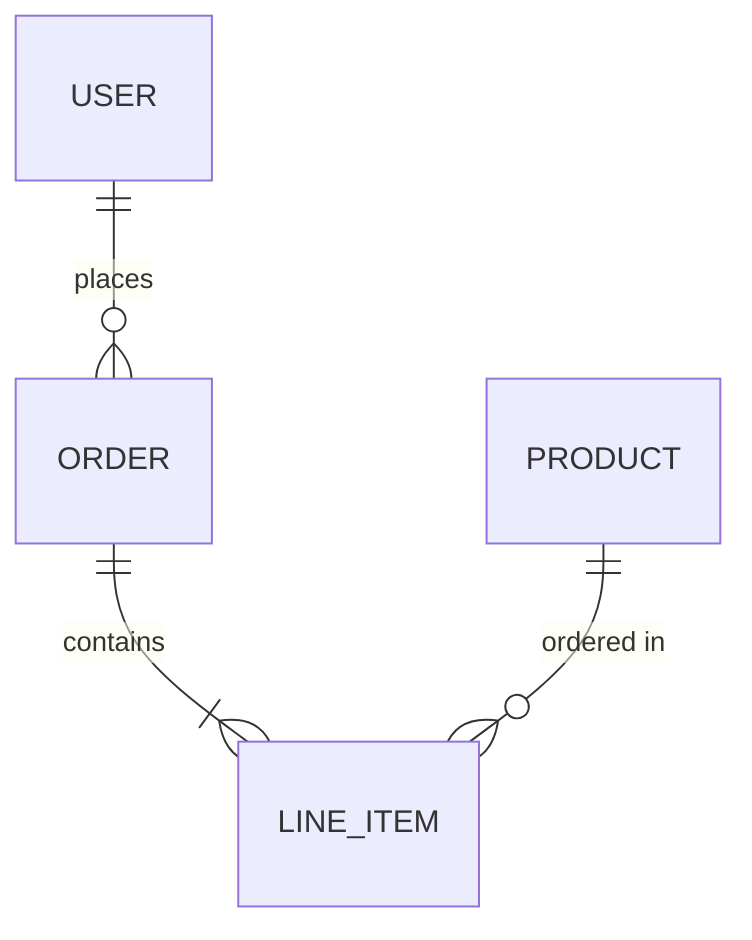
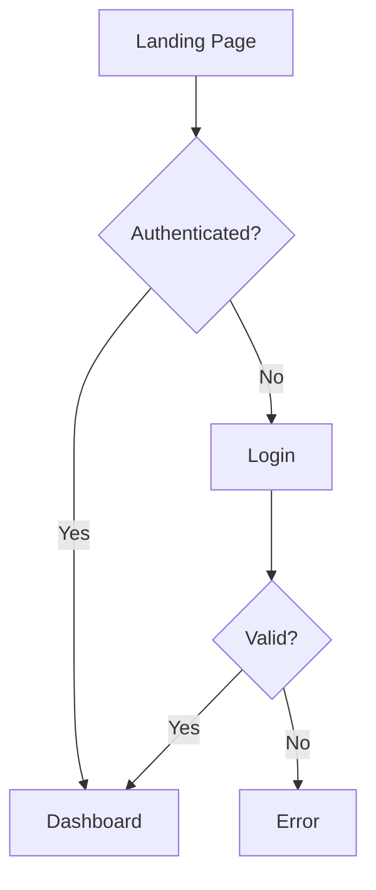
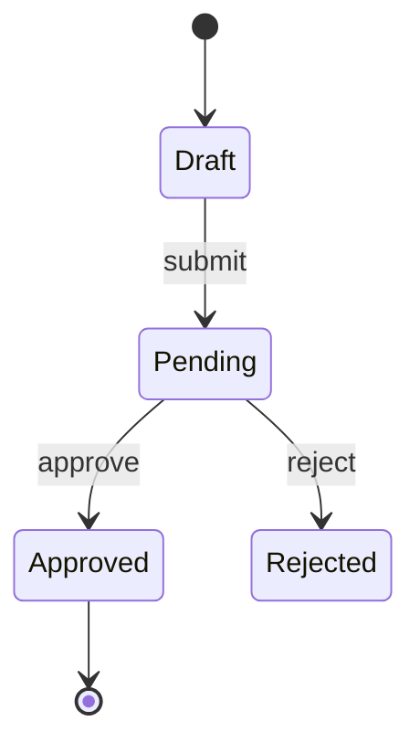
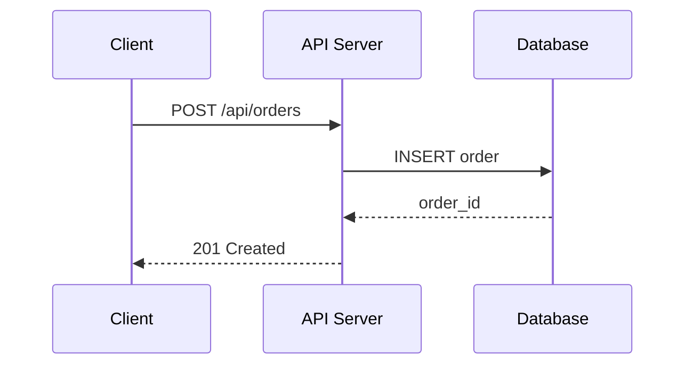

# Design Tools Reference

## Tool Separation

| Purpose | Primary Tool | Fallback |
|---------|-------------|----------|
| **UI mockups / app screens** | Stitch MCP | Text-based wireframe descriptions |
| **ERD, flowcharts, sequence diagrams** | Mermaid Chart MCP (`mcp__claude_ai_Mermaid_Chart__validate_and_render_mermaid_diagram`) | Mermaid syntax in markdown |
| **Architecture diagrams, wireframes** | Excalidraw MCP (`mcp__claude_ai_Excalidraw__*`) | Mermaid syntax in markdown |

## UI Mockups — Stitch MCP

Stitch MCP generates application and web UI mockups from natural language prompts.

> **Requires configuration.** If Stitch MCP is not available, skip screen generation and produce text-based wireframe descriptions + component specs instead. Do NOT use Canva, Excalidraw, or Mermaid for app mockups — they are not suited for this.

**Screen generation prompt pattern:**
```
Create a {screen_type} for {app_description}.

User story: {user_story}

This screen should:
- {acceptance_criterion_1}
- {acceptance_criterion_2}

Layout: {mobile_first | desktop_first}
Style: {modern minimal | data-dense | marketing | dashboard}
```

**Screen editing prompt pattern:**
```
Edit this screen: {edit_instruction_from_user_feedback}
```

**Device variant generation:**
```
Generate a mobile variant of this screen
Generate a tablet variant of this screen
```

## Technical Diagrams — Mermaid Chart MCP

Use Mermaid Chart MCP as the **primary** tool for all technical diagrams. This is NOT a fallback — it's the right tool for structured diagrams.

**ERD (Entity Relationship Diagram):**


**User flow diagram:**


**State transition diagram:**


**API sequence diagram:**


## Architecture Diagrams — Excalidraw MCP

Use Excalidraw MCP for freeform diagrams that need spatial layout:
- System architecture (boxes + arrows)
- Infrastructure topology
- Component interaction diagrams
- Wireframe sketches (low-fidelity layout exploration)

**Available tools:**
- `mcp__claude_ai_Excalidraw__create_view` — create a new diagram
- `mcp__claude_ai_Excalidraw__export_to_excalidraw` — export to .excalidraw format
- `mcp__claude_ai_Excalidraw__save_checkpoint` / `read_checkpoint` — save/restore state

Save outputs to `.prd/phases/{NN}-{name}/design/diagrams/`

## Chrome DevTools MCP (Browser Review)

Used in [2d] Design Iteration to preview generated HTML screens in a real browser:
- Open `source.html` at different viewport sizes (375px, 768px, 1440px)
- Take screenshots for visual comparison
- Inspect accessibility: contrast ratios, focus order, semantic HTML
- If not configured, review screens via file content only

## No-Tool Fallback

If no MCP tools are available:
- Generate Mermaid syntax diagrams embedded in markdown files
- Write text-based wireframe descriptions (component layout + content)
- Document design decisions in prose for Sprint implementation
